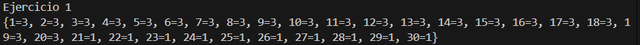
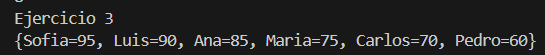
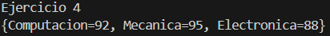

# Práctica: Estructuras No Lineales - 

## Autor
- Nombre: [Juan Miguel Naula A.]
- Carrera/Curso: [Estructura de datos]

##  Ejercicios sobre Mapas  - 19/01/26
- Práctica: [Ejercicios sobre mapas]
- Fecha: [2026-01-19]

## Descripción
Resolucion de ejercicios sobre mapas, aplicando la clase EjerciciosMapas.java, y dentro de ella aplicando 4 metodos lo cuales serian los ejercicios.

## Evidencias
### Ejercicio 1
Inserta aquí la captura del código o de la ejecución.
- Archivo: 

### Ejercicio 2 
Inserta aquí una segunda captura si aplica.
- Archivo: 

### Ejercicio 3
Inserta aquí una segunda captura si aplica.
- Archivo: 

### Ejercicio 4
Inserta aquí una segunda captura si aplica.
- Archivo: 
